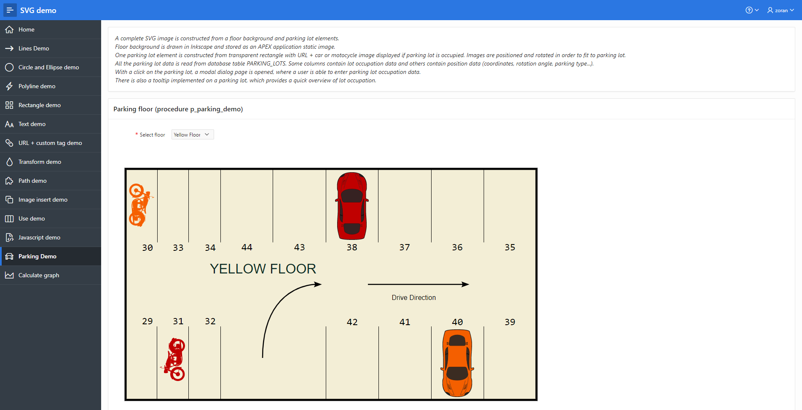

# Oracle PL/SQL Package for SVG Images Generation
SVG Images Generator PL/SQL package provides functionality to quickly and efficiently generate SVG images directly from the Oracle database.

It requires no additional resources and it is developed in pure PL/SQL.

## Changelog
- 1.0 - Initial Release

## Install PL/SQL package
- download 2 script files from "package" directory 
- execute them in database schema in following order:
1. PKS script file (package definition)
2. PKB file (package body)

New Package ZT_SVG is created in database schema.

## How to use PL/SQL package
Procedure and Function descriptions with input and output parameters are located in package definition script.

First initialize the image using p_new_image procedure.

Then draw elements using various procedures such as p_draw_line, p_draw_ellipse...

At the end finish the image using function f_finish_image, which returns XML source of SVG image.

## Demo
A demo script together with demo package and APEX application is located under "demo" directory.

First execute the script tables_and_data.sql, which will create demo tables and populate them with data.

Then install demo database package ZT_SVG_DEMO (specification and body).

At the end import APEX demo aplication and run it.

*Demo script and package should be installed in a database schema assigned to a workspace, where is the application imported.* 

